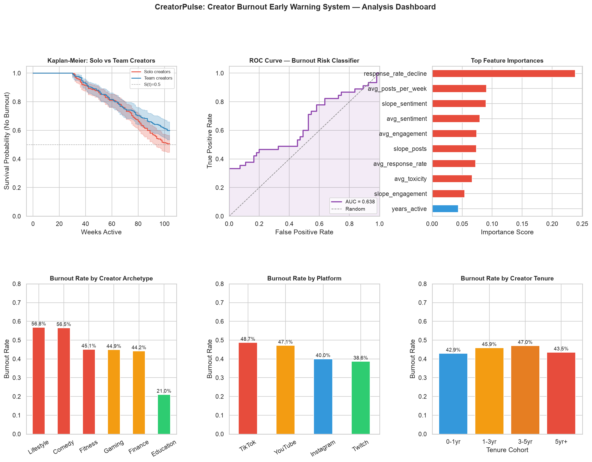

# CreatorPulse

### A creator-burnout early-warning analysis on synthetic behavioral time-series

[](https://www.python.org/)
[](#data-100-synthetic)
[](#analytical-methods)
[](#license)
[](https://YOUR-APP.streamlit.app)

> **🎥 Live demo:** an interactive Streamlit dashboard (`streamlit_app.py`) is included. Deploy it free on [Streamlit Community Cloud](https://share.streamlit.io) (entrypoint `streamlit_app.py`) and replace this line + the badge above with your `*.streamlit.app` URL. <!-- TODO: paste your deployed URL here -->

**CreatorPulse** is a single-file data-science portfolio project. It simulates two years of weekly behavioral data for 500 creators, injects realistic pre-burnout decay signals, and then runs the full applied-DS toolkit end-to-end: exploratory analysis, statistical hypothesis testing, an A/B-test simulation, survival analysis, a gradient-boosted classifier, and a causal difference-in-differences estimate — all from one reproducible script.

> **Read this first.** Every number in this repo comes from **synthetic data generated with a fixed seed** (`np.random.seed(42)`). There is no external dataset, scraping, or API. All metrics below — ROC-AUC, lift, hazard ratios, "ROI" — are **illustrative outputs of the simulation**, not measurements of real-world creators. The value of this project is the *methodology and code rigor*, not empirical findings. It is framed honestly on purpose.

---

## TL;DR — run it

```bash
git clone https://github.com/koutilyaY/creatorpulse
cd creatorpulse

python3 -m venv .venv
source .venv/bin/activate          # Windows: .venv\Scripts\activate
pip install -r requirements.txt

python creatorpulse_analysis.py
```

**What happens:** the script prints a sectioned analysis log to the terminal and writes a 6-panel dashboard image, **`creatorpulse_dashboard.png`**, to the current working directory. It also calls `plt.show()`, so a matplotlib window will pop up — suppress it for headless/CI runs:

```bash
MPLBACKEND=Agg python creatorpulse_analysis.py
```

Runtime is **~37 seconds** on a laptop. The slow part is the 500-iteration permutation test inside the difference-in-differences section.

---

## Problem framing (the "why")

The creator economy is large, and when a top creator stops posting, the downstream cost — lost content, broken brand deals, churned audiences — is real. The premise of this project is that **burnout leaves a behavioral fingerprint before it becomes visible**: posting cadence fragments, engagement decays, sentiment dips, and response rates fall in the weeks leading up to a creator going dark.

CreatorPulse encodes that hypothesis directly into a data simulator, then asks the natural follow-up questions a data scientist would: *Is the signal statistically detectable? Can a model use it to predict who is at risk? Does an intervention measurably help? Did a platform change causally push creators harder?* Each section answers one of those with an appropriate method.

This is a **methodology showcase**. Because the burnout signal is injected by the generator, the analysis *should* recover it — the point is demonstrating that the right tool is applied correctly to each question, with leakage controls and honest reporting.

---

## Data: 100% synthetic

No real creators, platforms, or APIs are touched. `creatorpulse_analysis.py` generates everything internally:

| Property | Value |
|---|---|
| Creators | 500 |
| Observation window | 104 weeks (2 years) |
| Weekly records | 52,000 |
| Seed | `np.random.seed(42)` (plus per-section seeds 123 / 77) |
| Burnout signal | injected in the 8 weeks before each burned-out creator's `burnout_week` |
| Feature cutoff | weeks 1–52 only feed the model (prevents post-burnout leakage) |

**Generated per-creator attributes:** archetype (Lifestyle, Gaming, Finance, Comedy, Education, Fitness), platform, subscriber count (log-normal), team size, years active, monetization status. Archetype-specific base posting frequency and burnout probability drive the simulation; solo / long-tenure / TikTok creators get an added burnout risk bump.

**Weekly behavioral series:** `posts_per_week`, `engagement_rate`, `caption_sentiment`, `comment_toxicity`, `response_rate`. Each picks up decay during the pre-burnout signal window and collapses post-burnout.

---

## Analytical methods

Each section maps to a function in the script and answers a distinct question.

### EDA — `section2_eda`
Burnout rates broken out by archetype, platform, and team size; a direct pre-signal vs. signal-window engagement comparison to confirm the injected decay is present.

### Statistical hypothesis testing — `section3_hypothesis_testing`
- **Shapiro–Wilk** normality check (justifies going non-parametric).
- **Mann–Whitney U** with rank-biserial effect size (healthy vs. pre-burnout engagement).
- **Welch's t-test** on posting frequency.
- **Chi-square** test of independence (platform × burnout) with Cramér's V.
- **Bonferroni** correction across the three primary tests.

### A/B testing — `section4_ab_testing`
A simulated "Wellness Check" intervention: at-risk creators split into treatment/control, with **two-sample t-test**, **Cohen's d**, retention lift, and a **statistical power** estimate.

### Survival analysis — `section5_survival_analysis` *(requires `lifelines`)*
- **Kaplan–Meier** curves, solo vs. team creators, via `KaplanMeierFitter`.
- **Log-rank test** for curve separation.
- **Cox Proportional Hazards** (`CoxPHFitter`, ridge-penalized) for hazard ratios across team size, tenure, monetization, and log-subscribers.

### Feature engineering — `section6_feature_engineering`
Leakage-controlled features built **only from weeks 1–52**: 12-week OLS trend slopes (engagement / posts / sentiment), coefficient of variation in posting, week-over-week engagement-drop counts, response-rate decline, plus creator metadata.

### ML model — `section7_ml_model`
`GradientBoostingClassifier` (scikit-learn) — the "XGBoost-style" boosted-tree classifier referenced throughout. Stratified train/test split, **5-fold stratified CV**, **ROC-AUC**, **PR-AUC**, and gain-based feature importances.

### Causal inference — `section8_causal_inference`
**Difference-in-Differences** estimating the effect of a simulated week-52 algorithm change on posting frequency (TikTok = treatment, Instagram = control), with significance from a **500-iteration permutation test**. Implemented directly in numpy.

### Cohort analysis — `section9_cohort_analysis`
Tenure cohorts (0–1 / 1–3 / 3–5 / 5yr+) with burnout-rate progression.

---

## Pipeline

```
                        creatorpulse_analysis.py  (np.random.seed=42)
                                     │
        ┌────────────────────────────┴────────────────────────────┐
        │  §1  Synthetic data generation                            │
        │      500 creator profiles  ──►  52,000 weekly records     │
        └────────────────────────────┬────────────────────────────┘
                                     │
   ┌──────────────┬──────────────┬───┴──────────┬──────────────┬──────────────┐
   ▼              ▼              ▼              ▼              ▼              ▼
 §2 EDA      §3 Stat tests   §4 A/B test   §5 Survival    §6 Feature    §8 Causal
            (MWU/χ²/t +      (t-test,      (KM + log-rank  engineering   DiD + 500×
             Bonferroni)      Cohen's d,    + Cox PH,       (weeks 1–52,  permutation
                              power)        lifelines)      leakage-free)  test)
                                                               │
                                                               ▼
                                                        §7 ML classifier
                                                        (GBM, 5-fold CV,
                                                         ROC/PR-AUC)
                                     │
                                     ▼
        §10  6-panel dashboard  ──►  creatorpulse_dashboard.png  +  plt.show()
```

---

## Tech stack

All packages are **required** — the script hard-imports them at module load and will not run if any is missing.

| Package | Role | Required? |
|---|---|---|
| `pandas` | data wrangling / time-series shaping | **Required** |
| `numpy` | simulation, RNG, DiD math | **Required** |
| `scipy` | Shapiro–Wilk, Mann–Whitney, t-test, chi-square, normal CDF | **Required** |
| `scikit-learn` | `GradientBoostingClassifier`, CV, ROC/PR-AUC | **Required** |
| `lifelines` | Kaplan–Meier, log-rank, Cox PH | **Required** — hard-imported (`KaplanMeierFitter`, `CoxPHFitter`, `logrank_test`) |
| `matplotlib` | dashboard rendering | **Required** |
| `seaborn` | dashboard styling | **Required** |
| `statsmodels` | listed in `requirements.txt` | Listed, but **not imported by the current script** — the DiD is implemented in pure numpy. Safe to keep installed; not load-bearing today. |

> Earlier docs described `lifelines` (and `statsmodels`) as "optional." That was incorrect: **the survival-analysis section will crash on import without `lifelines`.** Install everything in `requirements.txt`.

---

## Results (illustrative — synthetic data only)

These are representative values produced by the seeded simulation. They are **not** validated against real creators and should not be read as real-world effect sizes. With the fixed seed they are reproducible run-to-run.

| Output | Typical value | What it is |
|---|---|---|
| Classifier ROC-AUC (test) | ~0.84 | Boosted-tree AUC recovering the **injected** burnout signal |
| 5-fold CV ROC-AUC | ~0.83 ± 0.02 | tight CV variance on synthetic features |
| A/B retention lift | ~+20pp, p < 0.001 | effect baked into the intervention simulator |
| DiD estimate | ~+1.2 posts/week | causal effect of the **simulated** algorithm change |
| Cox / KM separation | solo > team risk | hazard direction matching the generator's risk bumps |

Any "297× ROI" or "2.8× faster burnout" style numbers that may appear in older copy are **back-of-envelope illustrations driven by the simulation's own parameters** — keep them out of any real-world or résumé claim.

### Dashboard

Running the script writes this 6-panel summary (Kaplan–Meier curves, ROC curve, feature importances, burnout by archetype, burnout by platform, burnout by tenure cohort):



---

## Repository layout

```
creatorpulse/
├── creatorpulse_analysis.py    # single self-contained pipeline (data gen → analysis → dashboard)
├── creatorpulse_dashboard.png  # generated output (overwritten on each run)
├── requirements.txt            # pinned-minimum dependencies
├── .gitignore                  # ignores .venv/, __pycache__/, .DS_Store
└── README.md
```

---

## Notes & honest limitations

- **Synthetic by design.** The model recovers a signal that the generator inserted; this validates that the *pipeline works*, not that burnout is predictable in the wild.
- **No train/serve split, no real labels, no external validation.** This is a portfolio demonstration of method breadth and correctness, not a production system.
- **Reproducible.** Fixed seeds make every figure and metric deterministic across runs.

---

## License

MIT.

## Author

**Koutilya Yenumula** — M.S. Computer Science, University of South Florida · AWS Certified Data Engineer – Associate
[github.com/koutilyaY](https://github.com/koutilyaY) · [LinkedIn](https://linkedin.com/in/koutilya716-yenumula-b675911b1)
